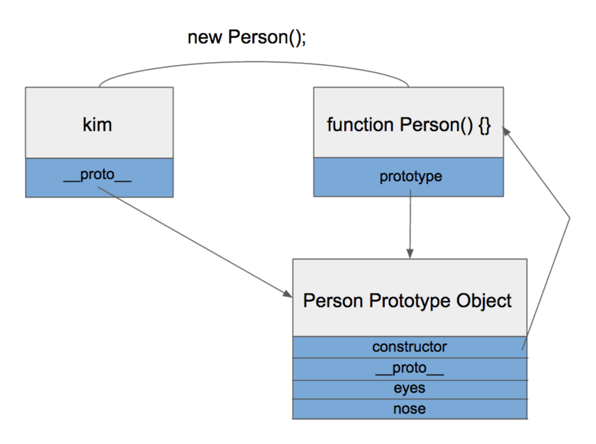
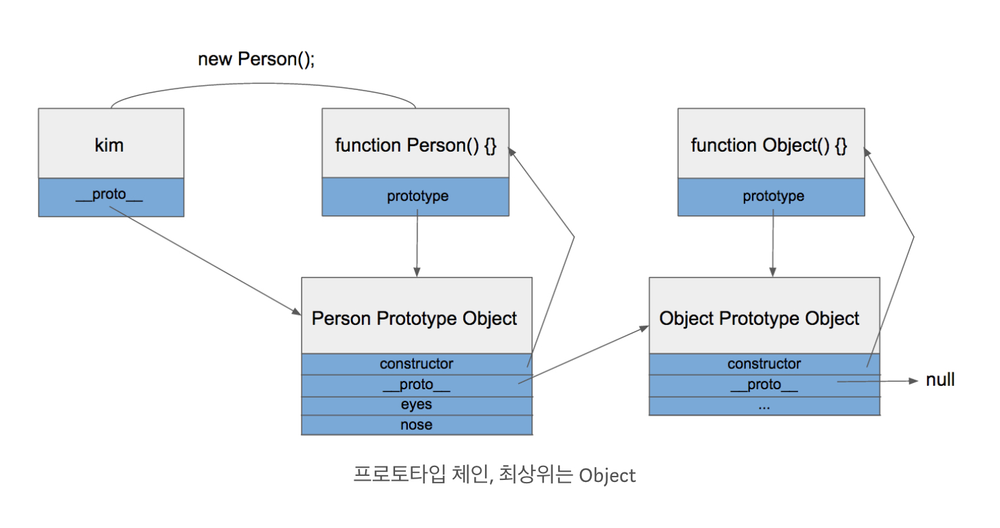

# Class

## 클래스 정의

ES6에서 새로 나온 것, Class는 사실 ES5의 `function` 과 동일하다.

- function를 정의하는 방법

  ```javascript
  // 선언식
  function Animal (name, sound) {
      this.name = name;
      this.sound = sound;
  }
  
  // 표현식
  const Animal = function(name, sound) {
      this.name = name;
      this.sound = sound;
  }
  
  ```

- Class를 정의하는 방법

  ##### Class 선언

  ```javascript
  class Animal {
      constructor(name,sound) {
          this.name = name;
          this.sound = sound;
      }
  };
  ```

  >
  >
  > ```javascript
  > const animal = new Animal(); // ReferenceError
  > 
  > class Animal {}
  > ```


  ##### Class 표현

  ```javascript
  const Animal = class {
      constructor(name,sound) {
          this.name = name;
          this.sound = sound;
      }
  };
  ```


##### poiemaweb sample code

```javascript
class Person {
  constructor(name) {
    this._name = name;
  }

  sayHi() {
    console.log(`Hi! ${this._name}`);
  }
}

const me = new Person('Lee');
me.sayHi(); // Hi! Lee

console.log(me instanceof Person); // true
```


## 인스턴스 생성

```javascript
class Animal {}

const animal = new Animal();
```

New 연산자와 함께 생성자(constructor)를 호출한다.

위 코드에서 new 연산자와 함께 호출한 Foo는 클래스의 이름이 아니라 constructor이다. 표현식이 아닌 선언식으로 정의한 클래스의 이름은 constructor와 동일하다.

```javascript
console.log(Foo === Foo.prototype.constructor); // true
```

new 연산자를 사용하지 않고 constructor를 호출하면 타입 에러(TypeError)가 발생한다. constructor는 new 연산자 없이 호출할 수 없다.

```javascript
class Foo {}

const foo = new Foo(); // TypeError: Class constructor Foo cannot be invoked without 'new'
```


## 생성자란?

**constructor**는 인스턴스를 생성하고 클래스 프로퍼티를 초기화하기 위한 특수한 메소드이다. 
constructor는 클래스 내에 한 개만 존재할 수 있다. 
인스턴스를 생성할 때 new 연산자와 함께 호출한 것이 바로 constructor이며 constructor의 파라미터에 전달한 값은 클래스 프로퍼티에 할당한다.

```javascript
class Animal {
    constructor(name, sound) {
        this.name = name;
        this.sound = sound;
    }
    
    bark() {
    	console.log(`${this.name} : ${this.sound}`)
    }
};

const dog = new Animal("삐삐", "멍멍");
const cat = new Animal("냥이", "야옹");
```


### 응용

```javascript
class Animal {
    constructor(
        name, 
        sound = "크으으으으"
    ) {
        this.name = name;
        this.sound = sound;
    }
    
    bark() {
    	console.log(`${this.name} : ${this.sound}`)
    }
    
    run () {
        console.log(`${this.name} : 달린다.`)
    }
};

const dog = new Animal("삐삐", "멍멍");
const dog = new Animal("삐삐", "멍멍");
const cat = new Animal("냥이", "야옹");
```


## 클래스 상속

새롭게 정의할 클래스가 기존에 있는 클래스와 매우 유사하다면, 상속을 통해 그대로 사용하되 다른 점만 구현하면 된다.

### Extends & Super

**extends** 키워드는 부모 클래스(base class)를 상속받는 자식 클래스(sub class)를 정의할 때 사용한다.

**super** 키워드는 부모 클래스를 참조(Reference)할 때 또는 부모 클래스의 constructor를 호출할 때 사용한다.

```javascript
class CompanionAnimal extends Animal {
    constructor(
    	name,
    	sound,
        ownerName 
    ) {
    	super(name, sound);
        this.ownerName = ownerName;
    }
}
```


## JS에게 Class란?

자바스크립트는 **프로토타입 기반** 객체지향 언어이다.
개발을 하다보면 Class를 접하게 되고 객체지향 언어에서는 필수적인 요소이다.
하지만 자바스크립트는 객체지향 언어임에도 불구하고 엄밀히 따지면 **Class라는 개념이 없다.** (Prototype로 흉내만 낼 뿐)

- Class



- Class Extends

  

