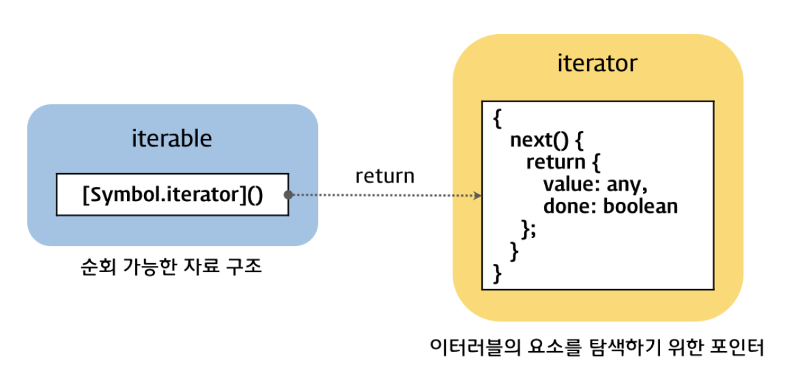

# 이터레이션 프로토콜(iteration protocol)과 for-of 루프

## 이터레이션 프로토콜

ES6에는 `이터러블(iterable)` 과 `이터레이터(iterator)` 를 정의한 이터레이션 프로토콜이 추가되었다.

> #### 이터러블(iterable)
>
> 이터러블은 **순회 가능한 자료 구조**이다. **Symbol.iterator를 프로퍼티 키로 사용한 메소드를 구현**하는 것에 의해 순회 가능한 자료 구조인 이터러블이 된다.

> #### 이터레이터(iterator)
>
> 이터레이터는 순회 가능한 객체이다. Symbol.iterator를 프로퍼티 키로 사용한 메소드는 이터레이터를 반환한다. 이터레이터는 순회 가능한 자료 구조인 이터러블의 각 요소를 순회하기 위한 포인터로서 **next 메소드**를 갖는다. next 메소드는 value, done 프로퍼티를 갖는 객체(iterator result)를 반환하며 이 메소드를 호출하여 이터러블 객체를 순회하며 단계별로 제어할 수 있다.



```javascript
[1, 2, 3, 4]

Array.prototype[Symbol.iterator]()
```


## Iterables

`iterable` 프로토콜은 반복 가능한 객체를 나타내는 프로토콜로 `for..of` 등에서 반복되는 행동을 정의하는 객체를 `반복 가능`하다고 한다.
반복 가능한 객체로는 내장 객체인 `Array`, `Map`, `Set`, `String` 등이 있다. 또한, `[Symbol.iterator]`라는 키를 가진다.

```javascript
/*
이터러블
Symbol.iterator를 프로퍼티 키로 사용한 메소드를 구현해야 한다.
배열에는 Array.prototype[Symbol.iterator] 메소드가 구현되어 있다.
*/
const iterable = [1, 2, 3];


/*
이터레이터
이터러블의 Symbol.iterator를 프로퍼티 키로 사용한 메소드는 이터레이터를 반환한다.
*/
const iterator = iterable[Symbol.iterator]();

/*
다음과 같은 방식으로 멀티라인이 아닌 한줄로도 처리 가능하다.
*/
const iterator2 = [1, 2, 3][Symbol.iterator]();


/*
이터레이터는 순회 가능한 자료 구조인 이터러블의 각 요소를 순회하기 위한 포인터로서 value, done 프로퍼티를 갖는 객체(iterator result)를 반환하는 next 메소드를 갖는 객체이다.
이터레이터의 next 메소드를 호출하여 이터러블 객체를 순회하며 단계별로 제어할 수 있다.
*/
iterator.next().value; // 1
iterator.next().value; // 2
iterator.next().value; // 3
iterator.next().done; // true
```

반복가능한 객체를 만들기 위해서는 `[Symbol.iterator]`라는 키에 `next`라는 메소드를 가지는 객체를 반환하는 함수를 할당한다. 이 때, 이 함수의 반환 값은 `value` 프로퍼티를 가진 객체이다.


## Iterator

`iterator` 프로토콜은 반복 가능한 객체의 값을 시퀸스대로 처리하는 프로토콜로 다음은 iterator 에 대한 설명이다.

1. 컬렉션 내의 항목에 대해 한 번에 하나씩 접근하면서 현재의 위치를 추적하는 방법을 알고 있는 객체
2. 반복 가능 인터페이스에 의해 반환되는 객체

iterator 객체는 `next` 메소드를 통해 다음 시퀸스를 진행하게 된다. 이 메소드는 위에서 살펴본 대로 `value`와 `done`을 가진 객체를 리턴한다.

```javascript
const obj = {
  [Symbol.iterator]: () => {
    let i = 0;

    return {
      next: () => ({ value: i++ })
      },
    };
  },
};

const iterator = obj[Symbol.iterator]();

iterator.next().value; // 0
iterator.next().value; // 1
// ...
```


### 어디서 사용되지?

- spread 연산자

  ```javascript
  const hello = 'hello world';
  const helloArr = [...hello];
  
  for (let a of helloArr) {
      console.log(a);
  }
  ```

  

### 유저가 직접 정의해서도 사용 가능하다.

```javascript
var myIterable = {};
myIterable[Symbol.iterator] = function* () {
    yield 1;
    yield 2;
    yield 3;
};
[...myIterable]; // [1, 2, 3]


// 이렇게도 사용 가능
function* gen(){
  yield* ["a", "b", "c"];
}

gen().next(); // { value:"a", done:false }
```


## For-of 루프

for-of 루프는 이터러블 객체를 순회한다. for-of 루프는 이터러블 객체를 순회할 때마다 이터레이터의 next 메소드를 호출한다. next 메소드가 반환하는 객체(iterator result)의 done 프로퍼티가 true가 될 때까지 반복하며 value 프로퍼티의 값을 for-of 루프의 of 앞에 선언한 변수에 할당하고 반복문의 코드 블럭을 실행한다.

```javascript
// 배열
for (const val of ['a', 'b', 'c']) {
  console.log(val);
}

// 문자열
for (const val of 'abc') {
  console.log(val);
}

// Map
for (const [key, value] of new Map([['a', '1'], ['b', '2'], ['c', '3']])) {
  console.log(`key : ${key} value : ${value}`); // key : a value : 1 ...
}

// Set
for (const val of new Set([1, 2, 3])) {
  console.log(val);
}
```

위의 코드를 구식의 for문으로 만든다면?

```javascript
const arr = ['a', 'b', 'c'];

for (let a = 0; a < arr.length; a++) {
  console.log(arr[a]);
}
```

이터레이터와 for of 문을 사용하면 무한 루프를 만들 수 있다.

```javascript
function idMaker(){
    var index = 0;
    
    return {
       next: function(){
           return {value: index++, done: false};
       }
    };
}

var it = idMaker();

console.log(it.next().value); // '0'
console.log(it.next().value); // '1'
console.log(it.next().value); // '2'
// ...
```

